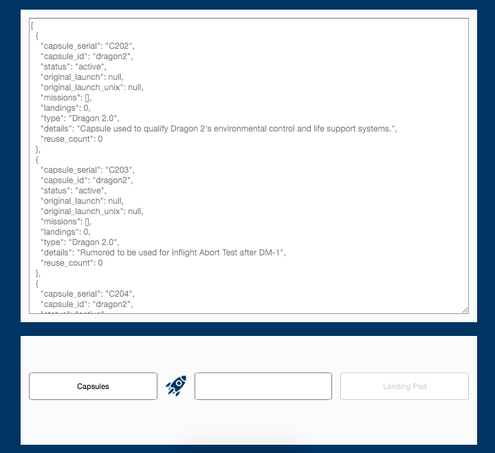

Working Demo (CLIENT ONLY) - https://space-x-api-beta.now.sh/

Prepared by : Christian R. Crisologo (Full-stack developer / Senior Front end Developer)

## Fix running docker for yosimite mac osx in local

- Create default docker machine with '\$ docker-machine create default'
- Run the default docker-machine '\$ docker-machine start default'
- Once the docker-machine default running, run the docker-compose and deploy '\$ docker-compose up -d'
- Fix for old osx to set the docker-machine default ip, '$ eval "$(docker-machine env default)" '
- Bind the ip to local client using '$ curl $(docker-machine ip default):3000'
- Do the same for the server '$ curl $(docker-machine ip default):4000'
  (by christian crisologo)
